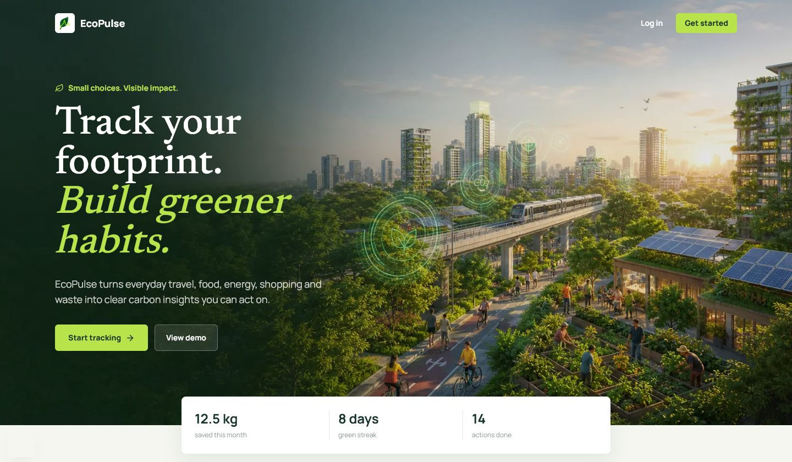
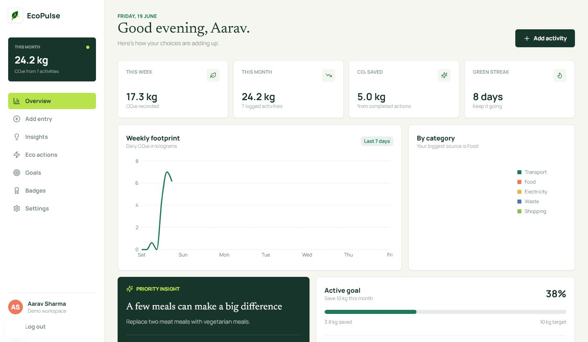
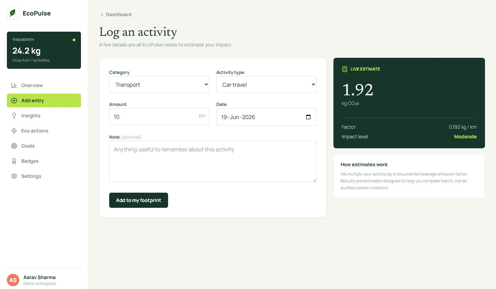

# EcoPulse - Personal Carbon Footprint Tracker

EcoPulse helps individuals understand, track, and reduce their carbon footprint through simple actions and personalized insights. It translates transport, electricity, food, shopping, and waste activity into comparable CO2e estimates and a practical weekly plan.

## Features

- Live carbon calculator with centralized emission factors
- Responsive dashboard with weekly trends and category charts
- Rule-based personalized insights and estimated savings
- Persisted eco actions, reduction goals, streaks, and six badges
- Supabase email authentication, protected routes, PostgreSQL, and RLS
- Full local demo mode available without credentials
- Accessible labels, keyboard focus, semantic navigation, and status messaging

## Tech Stack

Next.js 15 App Router, TypeScript, Tailwind CSS, Recharts, Lucide React, Supabase Auth/PostgreSQL, Zod, Vitest, and React Testing Library. The app is ready for Vercel.

## Architecture

Server routes validate all writes and obtain the authenticated user from secure Supabase cookies. RLS provides a second authorization boundary in PostgreSQL. Shared pure functions drive both UI calculations and tests. Demo mode uses the same typed UI contracts and persists state in `localStorage`.

## Local Setup

```bash
npm install
cp .env.example .env.local
npm run dev
```

Open `http://localhost:3000`. Select **View demo** to explore without Supabase.

## Supabase Setup

1. Create a Supabase project.
2. Run `supabase/migrations/001_initial_schema.sql` in the SQL editor.
3. Add the project URL and anon key to `.env.local`.
4. Add `http://localhost:3000/auth/callback` and the production equivalent to Auth redirect URLs.

```env
NEXT_PUBLIC_SUPABASE_URL=https://your-project.supabase.co
NEXT_PUBLIC_SUPABASE_PUBLISHABLE_KEY=your-publishable-key
```

No service-role credential is used by the application.

## Carbon Calculation

`src/lib/emission-factors.ts` multiplies activity values by documented approximate factors and rounds to two decimals. Recycling has a negative factor because it represents avoided emissions. These estimates support habit comparison and are not an audited inventory.

## Database

The schema contains `profiles`, `carbon_entries`, `eco_actions`, `goals`, `badges`, and `user_stats`. Foreign keys cascade on account removal, checks constrain user input, indexes support user/date queries, and every user-owned table has RLS enabled.

## Security and Accessibility

Zod validates server input, protected middleware uses `auth.getUser()`, RLS enforces ownership, notes have length limits, and errors avoid database details. Inputs have labels, icon buttons have accessible names, controls have visible focus states, status does not rely on color alone, and charts include text context.

## Testing

```bash
npm test
npm run build
```

Tests cover emission factors, negative recycling, eco-score bounds, largest-category selection, goal progress, insight priority, and badge unlocks.

## Screenshots

### Landing Page



### Dashboard



### Carbon Calculator



## Future Scope

AI-generated monthly reports, smart meter integrations, public transport recommendations, family challenges, college/company leaderboards, a carbon offset marketplace, and WhatsApp reminders.

## License

MIT
